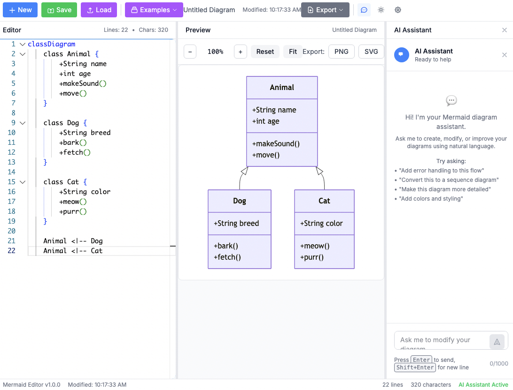
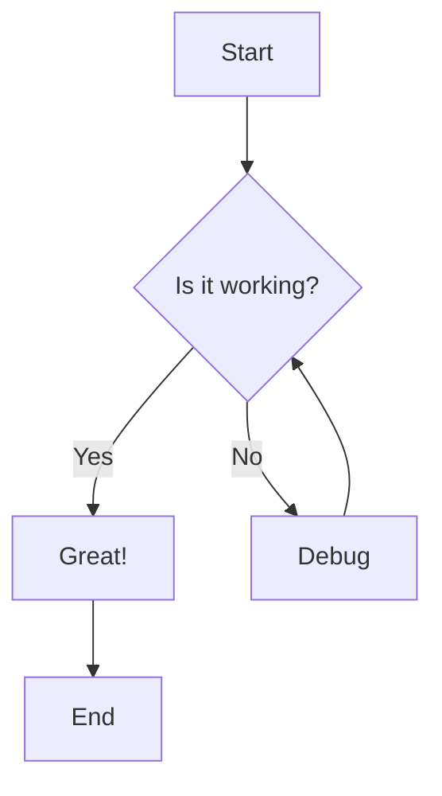

# 🧜‍♀️ Pako Mermaid UI

[](https://github.com/pkoptilin/pako-mermaid-ui/actions/workflows/docker-build.yml)
[](https://github.com/pkoptilin/pako-mermaid-ui/actions/workflows/ci-cd.yml)
[](https://ghcr.io/pkoptilin/pako-mermaid-ui)
[](https://github.com/pkoptilin/pako-mermaid-ui/releases)
[](https://opensource.org/licenses/MIT)

A modern, web-based Mermaid diagram editor with real-time preview and AI-powered assistance. Create beautiful diagrams using simple text syntax with the help of an intelligent AI assistant.



## ✨ Features

### 🎨 **Rich Editor Experience**
- **Monaco Editor** with Mermaid syntax highlighting
- **Real-time preview** with instant diagram rendering
- **Split-pane layout** with resizable panels
- **Dark/Light theme** support
- **Zoom and pan** controls for large diagrams

### 🤖 **AI-Powered Assistant**
- **Natural language processing** for diagram generation
- **OpenAI integration** for intelligent suggestions
- **Context-aware modifications** to existing diagrams
- **Interactive chat interface** for diagram refinement

### 📊 **Comprehensive Diagram Support**
- **Flowcharts** - Process flows and decision trees
- **Sequence Diagrams** - API interactions and workflows
- **Class Diagrams** - Object-oriented design
- **State Diagrams** - Application state management
- **ER Diagrams** - Database relationships
- **Gantt Charts** - Project timelines
- **Git Graphs** - Branch visualization
- **Mind Maps** - Brainstorming and planning
- **And many more!**

### 💾 **Data Management**
- **Save/Load diagrams** to local storage
- **Export functionality** (PNG, SVG, PDF)
- **Example templates** for quick start
- **Diagram history** and version management

### 🚀 **Performance & Reliability**
- **Debounced updates** prevent excessive re-rendering
- **Error handling** for invalid syntax
- **Responsive design** for desktop and tablet
- **Progressive Web App** capabilities

## 🚀 Quick Start

### Docker (Recommended)

```bash
# Run with Docker
docker run -d -p 3000:80 --name mermaid-ui ghcr.io/pkoptilin/pako-mermaid-ui:latest

# Or with Docker Compose
curl -o docker-compose.yml https://raw.githubusercontent.com/pkoptilin/pako-mermaid-ui/main/docker-compose.yml
docker-compose up -d
```

### Development Setup

```bash
# Clone the repository
git clone https://github.com/pkoptilin/pako-mermaid-ui.git
cd pako-mermaid-ui

# Install dependencies
npm install

# Start development server
npm run dev

# Build for production
npm run build
```

### 🌐 Access

Open your browser and navigate to:
- **Local development:** http://localhost:5173
- **Docker deployment:** http://localhost:3000

## 📖 Usage

### Basic Diagram Creation

1. **Start typing** Mermaid syntax in the editor
2. **See real-time preview** in the right panel
3. **Use examples** from the toolbar for inspiration
4. **Export your diagram** when ready

### AI Assistant

1. **Configure OpenAI API key** in settings
2. **Open chat panel** from the toolbar
3. **Describe your diagram** in natural language
4. **Let AI generate** and refine your diagrams

### Example Mermaid Syntax



## 🛠️ Configuration

### Environment Variables

```bash
# For development
VITE_OPENAI_API_KEY=your_openai_key_here

# For production (optional)
NODE_ENV=production
```

### OpenAI Setup

1. Get an API key from [OpenAI](https://platform.openai.com/api-keys)
2. Configure it in the application settings
3. Start chatting with the AI assistant

## 🐳 Docker Deployment

### Production Deployment

```bash
# Using Docker Compose
version: '3.8'
services:
  mermaid-ui:
    image: ghcr.io/pkoptilin/pako-mermaid-ui:latest
    ports:
      - "80:80"
    restart: unless-stopped
    environment:
      - NODE_ENV=production
```

### Available Images

- **GitHub Container Registry:** `ghcr.io/pkoptilin/pako-mermaid-ui`

### Image Tags

- `latest` - Latest stable release
- `v1.0.0` - Specific version
- `main` - Latest main branch
- `develop` - Development builds

## 🏗️ Architecture

### Tech Stack

- **Frontend:** React 18 + TypeScript
- **Build Tool:** Vite
- **Editor:** Monaco Editor
- **Diagrams:** Mermaid.js
- **Styling:** Tailwind CSS
- **State Management:** Zustand
- **AI Integration:** OpenAI API

### Project Structure

```
src/
├── components/         # React components
│   ├── App/           # Main application
│   ├── Chat/          # AI chat interface
│   ├── Editor/        # Monaco editor wrapper
│   ├── Layout/        # Layout components
│   ├── Preview/       # Mermaid preview
│   ├── SaveLoad/      # Diagram management
│   └── Toolbar/       # Top toolbar
├── hooks/             # Custom React hooks
├── services/          # API services
├── store/             # Zustand stores
├── types/             # TypeScript definitions
├── utils/             # Utility functions
└── constants/         # Configuration and examples
```

## 🚀 Development

### Prerequisites

- Node.js 18+
- npm or yarn
- Docker (optional)

### Development Commands

```bash
# Install dependencies
npm install

# Start development server
npm run dev

# Run linting
npm run lint

# Build for production
npm run build

# Preview production build
npm run preview

# Run Docker development
docker-compose --profile dev up
```

### GitHub Actions

The project includes automated CI/CD workflows for building and deploying Docker images. See [Workflows Documentation](.github/WORKFLOWS.md) for details on:

- Automated Docker builds
- Multi-platform images
- Security scanning
- Development workflows

### Code Quality

- **ESLint** for code linting
- **TypeScript** for type safety
- **Prettier** for code formatting
- **Husky** for git hooks

## 📚 API Documentation

### Diagram Export

```javascript
// Export as PNG
await exportToPNG(element, { filename: 'diagram.png' });

// Export as SVG
await exportToSVG(element, { filename: 'diagram.svg' });

// Export as PDF
await exportToPDF(element, { filename: 'diagram.pdf' });
```

### AI Integration

```javascript
// Generate diagram from description
const response = await openAIService.generateDiagram(
  "Create a user authentication flow",
  currentDiagram,
  systemPrompt
);
```

## 🤝 Contributing

We welcome contributions! Please see our [Contributing Guide](CONTRIBUTING.md) for details.

### Development Workflow

1. **Fork** the repository
2. **Create** a feature branch
3. **Make** your changes
4. **Add** tests if applicable
5. **Submit** a pull request

### Reporting Issues

- Use [GitHub Issues](https://github.com/pkoptilin/pako-mermaid-ui/issues)
- Include reproduction steps
- Provide browser/OS information

## 📜 License

This project is licensed under the MIT License - see the [LICENSE](LICENSE) file for details.

## 🙏 Acknowledgments

- **[Mermaid.js](https://mermaid.js.org/)** - For the amazing diagram rendering
- **[Monaco Editor](https://microsoft.github.io/monaco-editor/)** - For the excellent code editor
- **[OpenAI](https://openai.com/)** - For AI capabilities
- **[React](https://reactjs.org/)** - For the UI framework
- **[Vite](https://vitejs.dev/)** - For the fast build tool

## 🌟 Star History

[](https://star-history.com/#pkoptilin/pako-mermaid-ui&Date)

## 📞 Support

- **Documentation:** [Wiki](https://github.com/pkoptilin/pako-mermaid-ui/wiki)
- **Issues:** [GitHub Issues](https://github.com/pkoptilin/pako-mermaid-ui/issues)
- **Discussions:** [GitHub Discussions](https://github.com/pkoptilin/pako-mermaid-ui/discussions)

---

**Made with ❤️ by [pkoptilin](https://github.com/pkoptilin)**

*If you find this project helpful, please consider giving it a ⭐!*